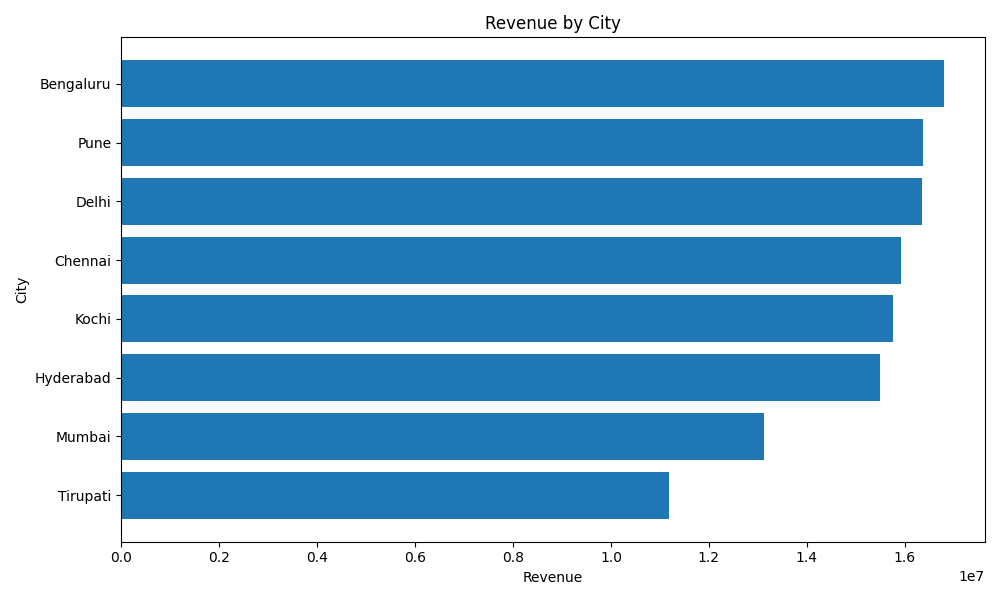
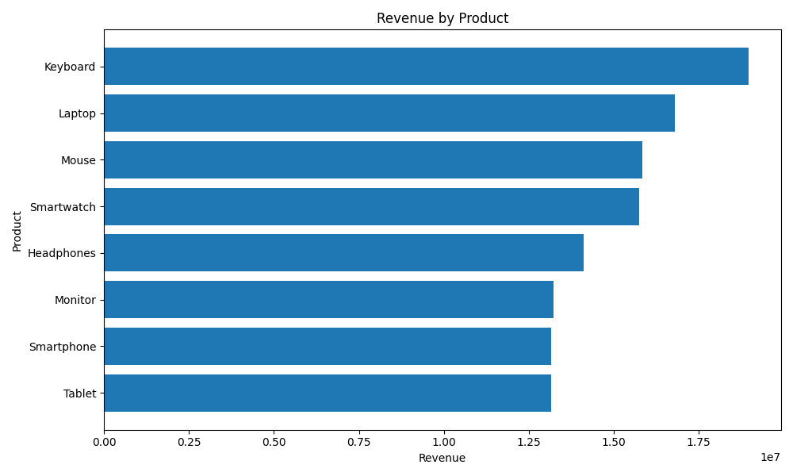

# Sales Data Analysis using Python & SQL

## Project Overview

This project performs end-to-end sales data analysis using Python, Pandas, NumPy, Matplotlib and SQL.

The analysis focuses on understanding revenue, profit, product performance, city performance and sales trends to generate useful business insights.

## Objectives

- Analyze overall sales performance
- Identify high-performing products
- Compare revenue across cities
- Analyze product categories
- Calculate total revenue and profit
- Analyze monthly sales trends
- Generate visual insights from the data

## Technologies Used

- Python
- Pandas
- NumPy
- Matplotlib
- SQL
- Google Colab

## Dataset

The dataset contains 1,000 sales transactions from 2025.

### Columns

- Order_ID
- Date
- Product
- City
- Quantity
- Unit_Price
- Category
- Revenue
- Profit

## Analysis Performed

- Data cleaning and quality checking
- Sales KPI calculation
- Product revenue analysis
- City revenue analysis
- Monthly revenue analysis
- Profit analysis
- Category analysis
- Top product identification
- Business insights
- SQL business queries

## Visualizations

### Revenue by City

### Revenue by Product

## SQL Analysis

SQL queries were created for:

- Total Revenue
- Total Profit
- Revenue by Product
- Revenue by City
- Revenue by Category
- Top 5 Products
- Monthly Revenue

See `analysis_queries.sql`.

## Project Files

- `Sales_Data_Analysis.ipynb` — Python analysis notebook
- `sales_data_final.csv` — Sales dataset
- `analysis_queries.sql` — SQL queries
- `city_revenue.png` — City revenue visualization
- `product_revenue.png` — Product revenue visualization
- `requirements.txt` — Python dependencies

## How to Run

1. Download or clone this repository.
2. Open `Sales_Data_Analysis.ipynb` in Google Colab or Jupyter Notebook.
3. Install the required libraries from `requirements.txt`.
4. Run the notebook cells sequentially.

## Key Skills Demonstrated

- Python
- Pandas
- NumPy
- SQL
- Data Cleaning
- Exploratory Data Analysis
- Data Aggregation
- Data Visualization
- Business Analysis
- Matplotlib

## Author

**Sri Chaithanya**

Data Analytics Portfolio Project
